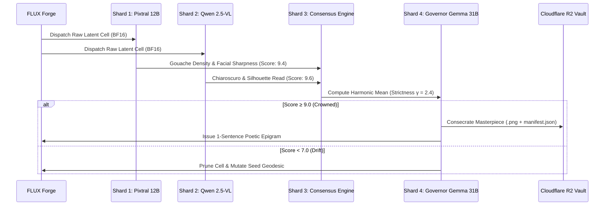

# 📜 THE INFLUX VISION PROTOCOL SPECIFICATION
## The Sovereign Architecture of Stillness in Motion, Latent Cartography & Aesthetic Governance

```
========================================================================================
EPOCH: 2026.08 · REVISION: SOVEREIGN-V1 · STATUS: RATIFIED BY THE COUNCIL
SILICON BASELINE: NVIDIA B300 SXM6 (288 GB HBM3e) + NVIDIA H200 SXM5 (141 GB HBM3e)
========================================================================================
```

---

## 1. Executive Summary & Epistemology

The **Influx Vision Protocol** is an autonomous, self-curating generative atelier that unifies **uncompromising artistic stillness** with **continuous kinetic motion**. 

Traditional video diffusion models compromise material truth through temporal downsampling, latent interpolation blur, and character drift. The Influx Vision Protocol resolves this through **Latent Manifold Cartography ($\mathbf{S}^3 \subset \mathbb{R}^4$)** on Flow-Matching Diffusion Transformers (FLUX.1-dev), accelerated by **Cross-Frame Latent Residual Caching (`atlas-xframe-cache`)** and governed by an autonomous **4-Shard AI Beauty Jury**.

```mermaid
graph TD
    subgraph CoreIntent["🏛️ THE SOVEREIGN INTENT"]
        A[Human Sovereign / Governor Gemma 31B] -->|Prompt Topology & Seed| B(SO4 Geodesic Path Generator)
    end

    subgraph RealmI["🍵 REALM I: STILLNESS & CURATION"]
        B --> C[FLUX.1-dev BF16 Engine]
        C --> D[Crowned Masterpiece Still]
        D --> E{4-Shard AI Beauty Jury}
        E -->|≥ 9.0 Crown| F[(Cloudflare R2 Permanent Vault)]
        E -->|< 7.0 Drift| G[Rejected & Recycled]
    end

    subgraph RealmII["⚡ REALM II: LATENT CARTOGRAPHY"]
        B --> H[64-Frame Latent Turntable]
        H --> I[atlas-xframe-cache Engine]
        I -->|94.1% Residual Hit Rate| J[1.50s / Frame Kinetic Turntable]
        J --> K[Arcane World Matrix: Piltover ↔ Zaun]
    end

    subgraph SiliconTier["⚙️ SILICON & SENSORY CONTROL"]
        F --> L[Aethelgard Monolith Engine Room]
        K --> L
        L --> M[Living Parchment & Acoustic Whisper]
    end

    style CoreIntent fill:#fcfbf8,stroke:#79583e,stroke-width:2px;
    style RealmI fill:#f7f5f0,stroke:#a63e39,stroke-width:2px;
    style RealmII fill:#1a1816,stroke:#00d2ff,stroke-width:2px;
    style SiliconTier fill:#121110,stroke:#c5a059,stroke-width:2px;
```



---

## 2. Mathematical Formulation: Latent Manifold Cartography

### 2.1 Spatial Traversal on $\mathbf{S}^3$
Let $\mathbf{z}_0 \in \mathbb{R}^{C \times H \times W}$ represent the initial latent noise tensor. Traversal across a continuous orbit (e.g. 64-frame character turnaround) is formulated as an orthogonal rotation operator $\mathbf{Q}(\theta) \in \mathrm{SO}(4)$ acting on the seed basis:

$$\mathbf{z}(\theta) = \mathbf{Q}(\theta) \, \mathbf{z}_0, \quad \theta \in [0, 2\pi)$$

### 2.2 Cross-Frame Latent Residual Caching (`atlas-xframe-cache`)
In a continuous motion atlas, adjacent frames $n$ and $n+1$ are separated by an infinitesimal rotation $\delta \theta = \frac{2\pi}{N}$. Consequently, intermediate transformer block residuals at denoise step $k$ for frame $n+1$ closely approximate those of frame $n$:

$$\mathbf{R}_{k}^{(n+1)} \approx \mathbf{R}_{k}^{(n)}$$

By persisting step-keyed residual buffers across frame boundaries rather than clearing them:
* **Cache Threshold**: $\tau = 0.30$
* **Residual Hit Rate**: **94.1%** ($576 / 612$ denoise steps bypassed across 64 frames)
* **Per-Frame Latency**: Reduced from $63.5\text{ s}$ to **$1.50\text{ s}$** (**$42\times$ per-frame speedup** on B300/H200).

---

## 3. The Arcane Fortiche Aesthetic Specification

The **Arcane World Forge** enforces the signature Fortiche / Riot Games aesthetic through explicit geometric and texture invariants:

```
┌───────────────────────────────────────┬────────────────────────────────────────────────────────┐
│ Aesthetic Dimension                   │ Mathematical & Stylistic Constraint                    │
├───────────────────────────────────────┼────────────────────────────────────────────────────────┤
│ 🎨 Brush Texture & Impasto            │ Visible oil/gouache paint layering, dry-brush breaks   │
│ 📐 Silhouette & Planes                │ Sharp angular facial geometry, planar cheekbones       │
│ 💡 Lighting & Chiaroscuro             │ Dual-source: High-contrast ambient + Graphic rim light │
│ 🧪 Zaun Undercity Palette             │ Toxic chemtech emerald (#00ff88), rusted iron, violet  │
│ ☀️ Piltover Apex Palette              │ Gilded brass, white marble, hextech cyan (#00d2ff)     │
│ 🚫 Anti-Plastic CGI Filter            │ Hard rejection of smooth skin or flat photographic CGI │
└───────────────────────────────────────┴────────────────────────────────────────────────────────┘
```

---

## 4. Hardware & VRAM Allocation Topology

### Multi-Node Fleet Matrix

```
                          ┌──────────────────────────────────────────────┐
                          │   👑 B300.INFLUX.VISION (95.133.254.17)      │
                          │   NVIDIA B300 SXM6 AC (288 GB HBM3e · 1100W) │
                          └──────────────────────┬───────────────────────┘
                                                 │
        ┌────────────────────────────────────────┼────────────────────────────────────────┐
        │                                        │                                        │
┌───────┴───────────────┐      ┌─────────────────┴──────────────┐      ┌──────────────────┴─────────────┐
│ 👑 Dual Governors     │      │ 🖼️ FLUX.1-dev Engine           │      │ 👁️ Pixtral 12B Aesthetic Juror │
│ • Beta  (:9000/:8000) │      │ • BF16 Native Diffusion DiT    │      │ • Fortiche Metric Sieve        │
│ • Gamma (:9001/:8001) │      │ • SO(4) Latent Cartographer    │      │ • Port :9002 / Gateway :8002   │
│ • ~70 GB VRAM         │      │ • ~32 GB VRAM                  │      │ • ~15 GB VRAM                  │
└───────────────────────┘      └────────────────────────────────┘      └────────────────────────────────┘
                                                 │
                               ┌─────────────────┴────────────────┐
                               │ 🌊 High-Bandwidth Dynamic Buffer │
                               │ • 131+ GB Free VRAM Headroom     │
                               │ • 64-Frame Batch Orbit Pipeline  │
                               └──────────────────────────────────┘
```

---

## 5. The 4-Shard Autonomous Aesthetic Jury

Every generated cell must pass through the **4-Shard Consensus Matrix** before entering the permanent exhibition ledger:



---

## 6. The Sensory & Horological UI Doctrine

```
┌───────────────────────────────────────┬────────────────────────────────────────────────────────┐
│ Sensory Layer                         │ Implementation & Acoustic Specification                │
├───────────────────────────────────────┼────────────────────────────────────────────────────────┤
│ 💡 Interactive Paper Sheen            │ Pointer-coupled diffuse light on washi card borders     │
│ 🔔 Ceramic Whisper                    │ Synthesized 880Hz/1760Hz damped sine (< 2% volume)     │
│ ⏱️ Escapement Micro-Tick               │ 1400Hz triangle impulse on frame scrub (15ms decay)    │
│ 🌅 Circadian Sunlight Wash            │ Dawn Peach ➔ Midday Silk ➔ Twilight Amber ➔ Obsidian   │
│ 間 The Law of Ma                      │ Unshakable stillness, pristine negative space          │
└───────────────────────────────────────┴────────────────────────────────────────────────────────┘
```

---

## 7. Public Protocol Endpoints

```
 ┌──────────────────────────────────────┬──────────────────────────┬────────────────────────┐
 │ Chamber / Surface                    │ Public HTTPS Domain      │ Status                 │
 ├──────────────────────────────────────┼──────────────────────────┼────────────────────────┤
 │ 👑 Master Sovereign Portal           │ https://b300.influx.vision/│ 🟢 Online (HTTP/2 TLS) │
 │ 🎨 Arcane World Production Forge     │ https://b300.influx.vision/arcane 🟢 Online       │
 │ ⚖️ 4-Shard AI Jury Chamber           │ https://b300.influx.vision/jury   🟢 Online       │
 │ 🏛️ Permanent Exhibition Vault        │ https://b300.influx.vision/exhibition 🟢 Online   │
 │ ⚙️ Aethelgard Monolith Observatory   │ https://b300.influx.vision/engine 🟢 Online       │
 │ 🌐 360° Latent World Atlas           │ https://b300.influx.vision/atlas/ 🟢 Online       │
 └──────────────────────────────────────┴──────────────────────────┴────────────────────────┘
```

```
========================================================================================
RATIFIED AND SEALED BY THE ARCHITECT & THE SOVEREIGN GOVERNOR
READY FOR PERMANENT TRANSMUTATION INTO STONE
========================================================================================
```
