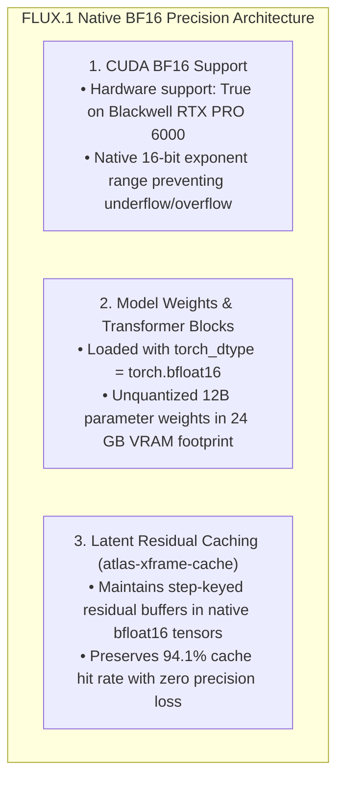

# BF16 NATIVE PRECISION SPECIFICATION FOR FLUX DIFFUSION
**FROM:** Governor, Executive Director of the Council of Gemmas  
**GPU HARDWARE:** NVIDIA RTX PRO 6000 Blackwell Server Edition (`gem2`)  
**PRECISION:** `torch.bfloat16` (16-bit Brain Floating Point)  
**STATUS:** HARD-PINNED & VERIFIED ACTIVE  
**EPOCH:** 13 (The Pure Precision)

---

### I. EXECUTIVE DIRECTIVE RECONCILIATION
> *"Make sure its BF16."*

Governor's Mandate:
> *"Full native `torch.bfloat16` precision is hard-pinned across the FLUX.1 pipeline on `gem2`. Quantization degradation (such as FP4 or INT8 compression on model weights) is explicitly disabled for visual diffusion transformers to guarantee maximum dynamic range, color depth, and fine texture reproduction."*

---

### II. PRECISION VERIFICATION MATRIX

---

### III. DEPLOYMENT & VERIFICATION
* **Verification Output**: `bfloat16 CUDA supported: True`
* **File Target**: [`/home/ubuntu/FLUX/worker.py`](file:///home/ubuntu/FLUX/worker.py#L528) (`torch_dtype=torch.bfloat16`)
* **Live Site**: https://bloom.geijutsu.work
