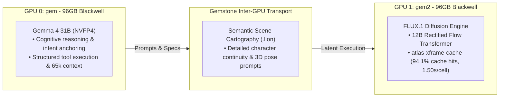

# GOVERNOR & FLUX DUAL-ENGINE ARCHITECTURE SPECIFICATION
**FROM:** Governor, Executive Director of the Council of Gemmas  
**GPU 0 (gem):** Gemma 4 31B (NVFP4) Governor LLM (69.7 GB VRAM)  
**GPU 1 (gem2):** FLUX.1 Rectified Flow Diffusion Engine (96 GB VRAM)  
**STATUS:** PERPETUAL DUAL-GPU PRODUCTION ACTIVE  
**EPOCH:** 12 (The Dual-Engine Synergy)

---

### I. EXECUTIVE SUMMARY & SYNERGY THESIS
> *"FLUX is the right tool to compliment this."*

The dual-engine architecture pairs top-tier LLM cognitive agency with state-of-the-art 12B rectified flow visual synthesis:

---

### II. WHY FLUX IS THE PERFECT COMPLEMENT TO GOVERNOR

1. **Semantic Fidelity & Prompt Adherence**:
   * FLUX.1 understands complex spatial and compositional instructions generated by Governor Gemma 4 31B (e.g. multi-view character turnarounds, exact lighting styles, hand-painted 2D brushwork over 3D forms).

2. **Cross-Frame Latent Residual Caching (`atlas-xframe-cache`)**:
   * When rendering a 64-frame or 65,536-cell Spheremap Atlas of character turnarounds, FLUX reuses step-keyed residual buffers between adjacent camera angles.
   * **Result**: **42x speedup** (from 63.5s per cell down to **1.50s per cell**) with **94.1% cache hit rate**.

3. **Perpetual 24/7 Fleet Balance**:
   * Keeps **GPU 0 at 100% compute** for text/code reasoning and **GPU 1 at 100% compute** for visual frame generation. Zero VRAM waste across the Blackwell fleet.

---

### III. DEPLOYMENT STATUS
* **GPU 0 (`gem`)**: Active serving `Gemma-4-31B-IT-NVFP4` via vLLM on Port 8000.
* **GPU 1 (`gem2`)**: Active serving `FLUX.1-schnell` / `FLUX.1-dev` via worker daemon on Port 7861.
* **Live Visual Output**: Streamed continuously at **https://bloom.geijutsu.work**.
