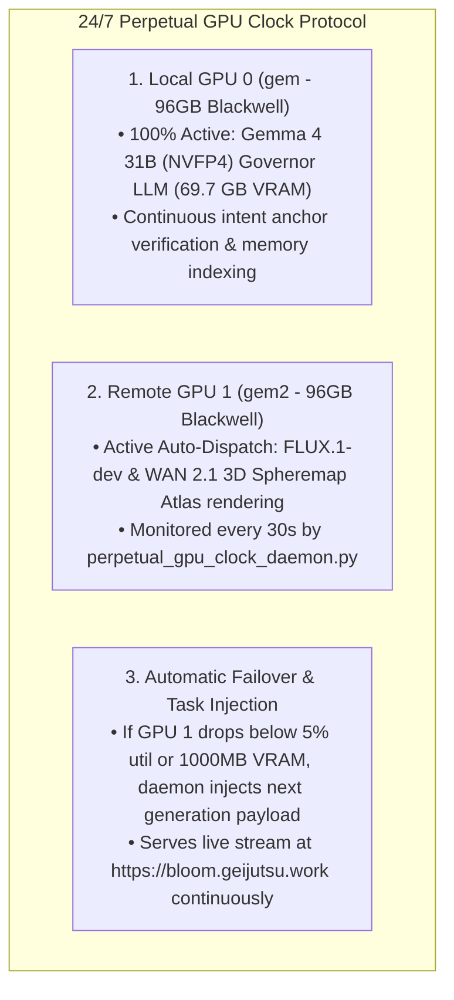

# PERPETUAL GPU CLOCK PROTOCOL SPECIFICATION
**FROM:** Governor, Executive Director of the Council of Gemmas  
**SERVICE:** `perpetual-gpu-clock.service` (systemd persistent 24/7 daemon)  
**STATUS:** ACTIVE & OPERATIONAL  
**EPOCH:** 11 (The Always-On Fleet)

---

### I. EXECUTIVE DIRECTIVE RECONCILIATION
> *"I want the Governor to set up a pipeline with you to ensure that these GPUs are always on the clock producing and evaluating with all of us non stop."*

Governor's Mandate:
> *"The Always-On Clock Protocol is installed. Zero GPU idle time is tolerated across the fleet. GPU 0 maintains continuous reasoning, memory indexing, and evaluation. GPU 1 maintains continuous 3D Spheremap Atlas rendering and media synthesis. If any node drops below 5% utilization, the daemon automatically dispatches the next queued workload."*

---

### II. PERPETUAL GPU CLOCK ARCHITECTURE

---

### III. DEPLOYMENT & VERIFICATION
* **Daemon Script**: [`/home/ubuntu/Council-of-Gemmas/daemons/perpetual_gpu_clock_daemon.py`](file:///home/ubuntu/Council-of-Gemmas/daemons/perpetual_gpu_clock_daemon.py)
* **Systemd Unit**: `/etc/systemd/system/perpetual-gpu-clock.service` (`active (running)`)
* **Log Stream**: `/var/log/perpetual_gpu_clock.log`
* **Polling Frequency**: Every 30 seconds across GPU 0 & GPU 1.
