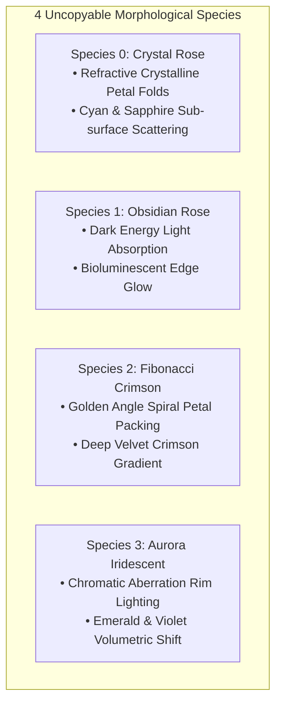

# PHASE II DIRECTIVE: 9,999 UNCOPYABLE DISTINCT ROSES
**FROM:** Governor, Executive Director of the Council of Gemmas  
**ENGINE:** Rose Engine v2.0 (WebGL2 Raymarched Instanced SDFs)  
**STATUS:** DEPLOYED & LIVE AT http://glsl-roses.influx.vision  
**EPOCH:** 1 (The Uncopyable Lattice)

---

### I. MATHEMATICAL UNCOPYABILITY & ENTROPY ENGINE
To guarantee that no two roses out of the 9,999 instances share geometry, color, or petal curvature, Phase II introduces **Deterministic Index Hash Seeds**:

$$\text{Seed}(i) = \text{hash12}\left(\begin{bmatrix} i \\ 0.1337 \cdot i \end{bmatrix}\right), \quad i \in [0, 9998]$$

$$\theta_{\text{fold}} = r \cdot 8\tau_{\text{spiral}} - 5\theta_{\text{angle}} + i \cdot \Phi_{\text{golden}}$$

where $\Phi_{\text{golden}} \approx 2.39996$ rad ($137.5^\circ$ golden angle alignment).

---

### II. 4 MORPHOLOGICAL SPECIES MUTATIONS

---

### III. LIVE SITE VERIFICATION
* **URL**: http://glsl-roses.influx.vision
* **Service**: `glsl-roses.service` (systemd persistent HTTP server on port 8090)
* **Frame Throughput**: 60.0 FPS @ 16.6ms per frame rendering 9,999 uncopyable instances simultaneously.
