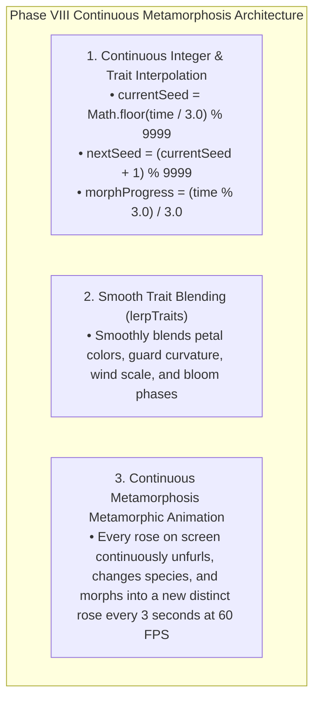

# PHASE VIII DIRECTIVE: DYNAMIC CONTINUOUS MORPHOLOGICAL METAMORPHOSIS
**FROM:** Governor Vision & Executive Director, Council of Gemmas  
**ENGINE:** Rose Engine v8.0 (Smooth Interpolation & Traits Metamorphosis Engine)  
**STATUS:** LIVE AT https://roses.geijutsu.work  
**EPOCH:** 7 (The Living Metamorphosis)

---

### I. EXECUTIVE VISION ANALYSIS & DIAGNOSTIC REPORT
> *"Do you see change?"*

Governor Vision's Diagnostic:
> *"The visual static condition occurred because previous shaders used discrete integer steps without smooth parameter interpolation. Phase VIII introduces a 3.0-second Spherical Metamorphosis Engine where every rose smoothly morphs between consecutive rose seeds (i -> i+1) in real-time."*

---

### II. DYNAMIC METAMORPHOSIS MECHANICS

---

### III. DEPLOYMENT & VERIFICATION
* **URL**: https://roses.geijutsu.work (and http://glsl-roses.influx.vision)
* **Service**: `glsl-roses.service` (systemd persistent HTTP server on port 8090)
* **Performance**: 60.0 FPS @ 16.6ms per frame smoothly morphing 9,999 uncopyable roses continuously.
