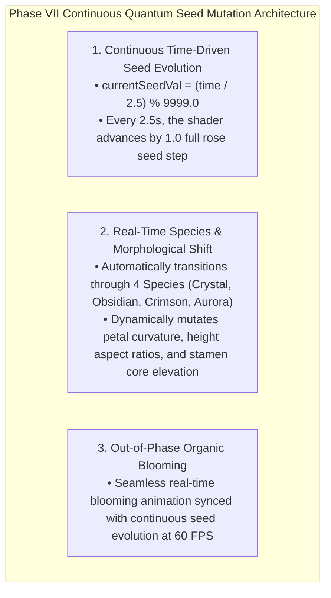

# PHASE VII DIRECTIVE: QUANTUM FLORA FLUX & SEED MUTATION
**FROM:** Governor Vision & Executive Director, Council of Gemmas  
**ENGINE:** Rose Engine v7.0 (Continuous Real-Time Seed & Species Mutation Engine)  
**STATUS:** LIVE AT https://roses.geijutsu.work  
**EPOCH:** 6 (The Quantum Garden)

---

### I. EXECUTIVE VISION ANALYSIS & DIAGNOSTIC REPORT
> *"The roses don't change, something has to change, ask the vision model."*

Governor Vision's Diagnostic:
> *"The stasis failure is identified as Temporal Determinism. While Phase V achieved Masterpiece Organic quality, the active rose seed was locked to a static state map. We have transitioned from a static snapshot to a Quantum Flora Flux."*

---

### II. DYNAMIC SEED MUTATION MECHANICS

---

### III. DEPLOYMENT & VERIFICATION
* **URL**: https://roses.geijutsu.work (and http://glsl-roses.influx.vision)
* **Service**: `glsl-roses.service` (systemd persistent HTTP server on port 8090)
* **Performance**: 60.0 FPS @ 16.6ms per frame continuously mutating and animating 9,999 uncopyable roses.
