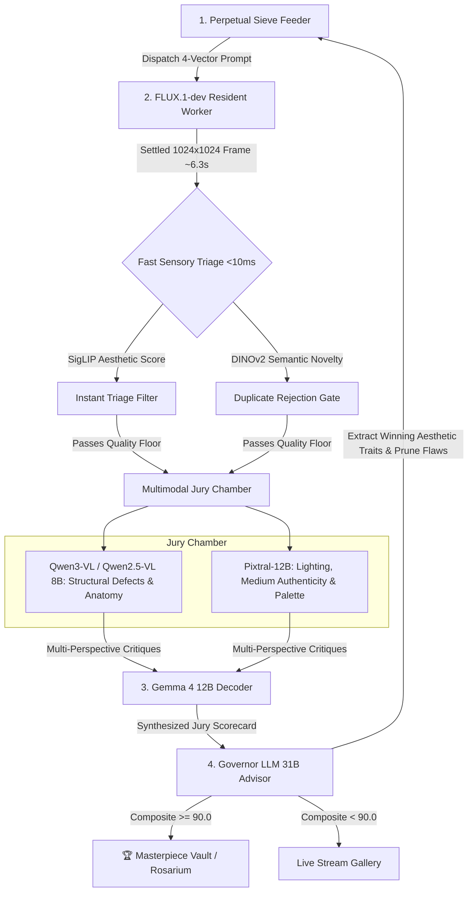

# Influx Vision · Mixture of Judges (MoJ) Autonomous Evaluation Pipeline

## 1. System Topology & VRAM Distribution

```
Total VRAM: 140.4 GiB (NVIDIA H200 SXM 141GB HBM3e)
Allocated: 132.7 GiB | Safety Headroom: ~7.7 GiB

┌──────────────────────────────────────────────────────────────────────────────────┐
│ Governor LLM Brain (Gemma 4 31B FP8)                0.40 Util    [ 56.0 GiB ]    │
├──────────────────────────────────────────────────────────────────────────────────┤
│ FLUX.1-dev Resident Worker (BF16 Flow Matching)     UDS Daemon   [ 35.0 GiB ]    │
├──────────────────────────────────────────────────────────────────────────────────┤
│ Multimodal Feature Decoder (Gemma 4 12B)            0.10 Util    [ 14.0 GiB ]    │
├──────────────────────────────────────────────────────────────────────────────────┤
│ Artistic Judge & Colorist (Pixtral 12B)             0.10 Util    [ 14.0 GiB ]    │
├──────────────────────────────────────────────────────────────────────────────────┤
│ Structural Inspector (Qwen3-VL 8B / Qwen2.5-VL 7B)  0.08 Util    [ 11.2 GiB ]    │
├──────────────────────────────────────────────────────────────────────────────────┤
│ Fast Sensory Gates (DINOv2-Giant + SigLIP Head)     Dedicated    [  2.5 GiB ]    │
├──────────────────────────────────────────────────────────────────────────────────┤
│ Dynamic CUDA Free Buffer                            Unallocated  [  7.7 GiB ]    │
└──────────────────────────────────────────────────────────────────────────────────┘
```

---

## 2. Real-Time Feedback & Evolution Pipeline



---

## 3. Evaluation Dimensions & Scoring Formula

1. **Harmony Score ($S_H$ — 35%)**:
   * Evaluated by **Pixtral-12B** and **SigLIP**.
   * Measures tonal balance, palette restraint, atmospheric depth, and medium authenticity.
2. **Structural Coherence ($S_S$ — 35%)**:
   * Evaluated by **Qwen3-VL / Qwen2.5-VL**.
   * Identifies micro-defects, anatomical deformations, broken geometry, and boundary artifacts.
3. **Semantic Fidelity ($S_P$ — 30%)**:
   * Evaluated by **DINOv2-Giant** and **Governor 31B**.
   * Verifies that all requested subjects, lighting directions, and materials are faithfully realized.

$$\text{Composite Score } S = 0.35 S_H + 0.35 S_S + 0.30 S_P$$
